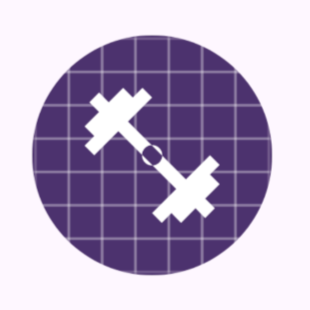
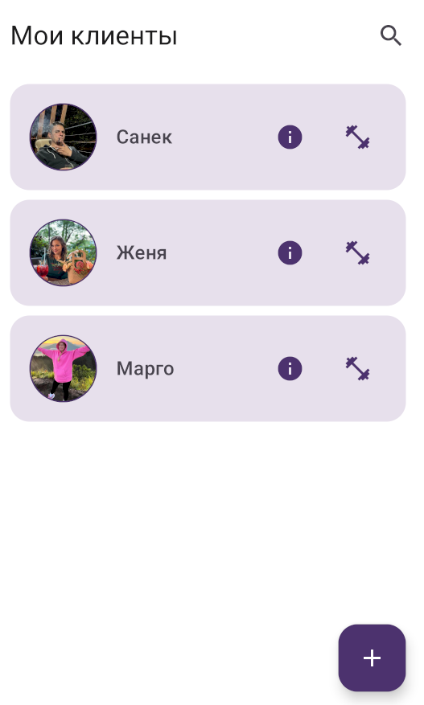
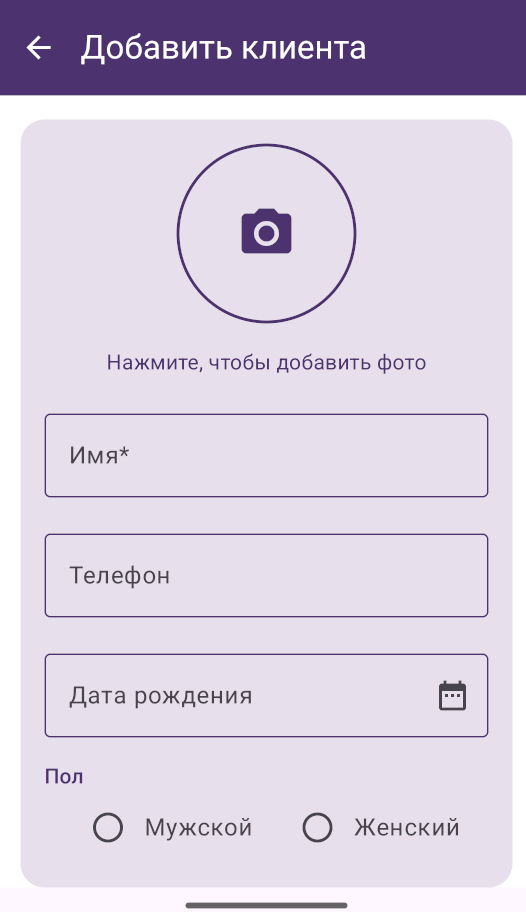
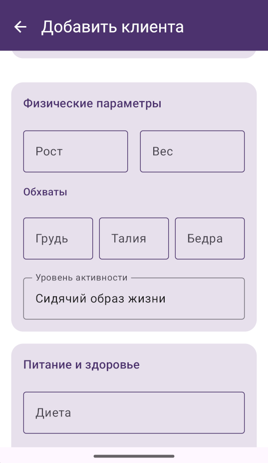
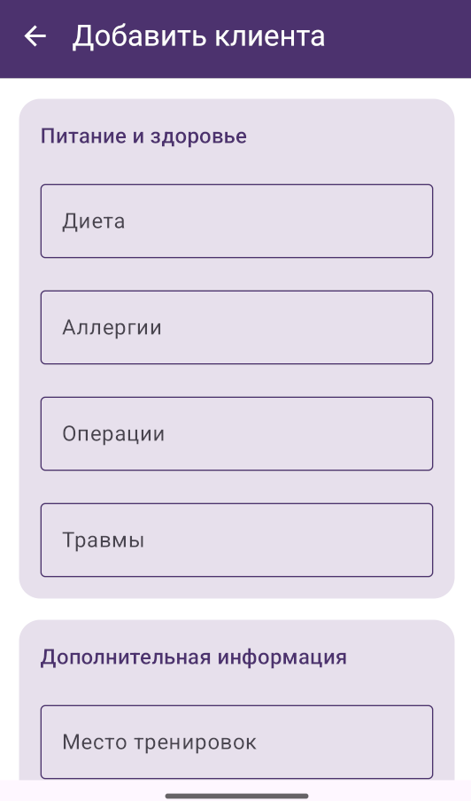
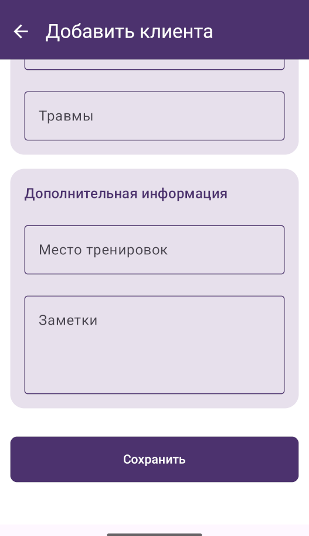
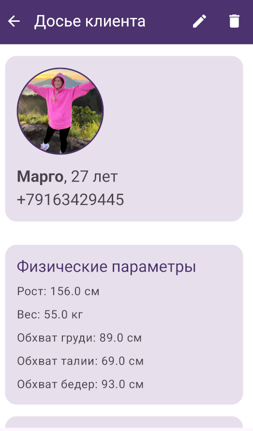
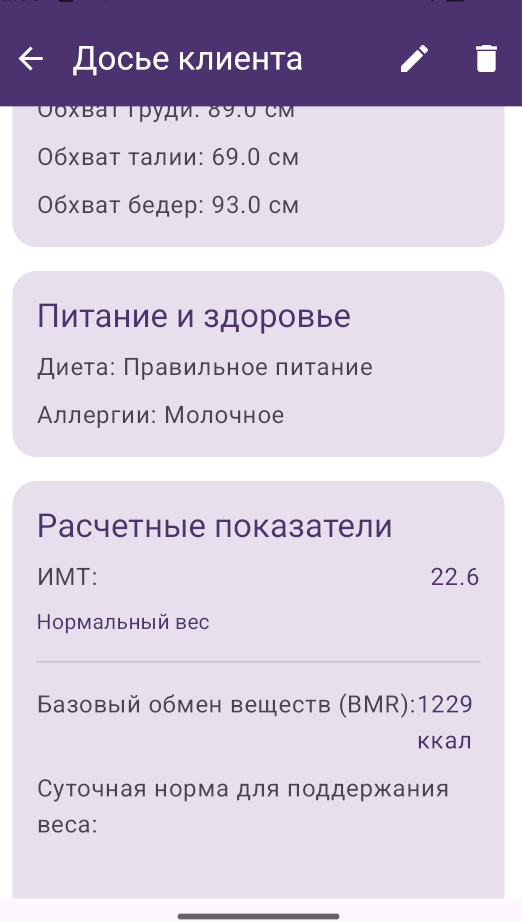
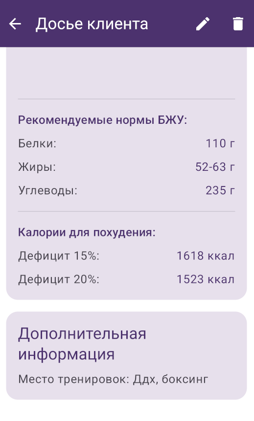

 # Тренерская

Это Android-приложение, созданное для фитнес-тренеров. Его основная цель — помочь тренерам в их повседневной работе, предоставив удобный инструмент для:
Ведения базы клиентов: Запись и хранение информации о клиентах (контакты, антропометрические данные, цели, заметки).
Планирования и учета тренировок: Создание тренировочных программ, запись проведенных занятий, включая выполненные упражнения, подходы, повторения и вес.
Расчетов: Быстрый расчет Индекса Массы Тела (ИМТ) и суточной нормы калорий, белков, жиров и углеводов (КБЖУ) для клиентов.
Визуализации расписания: Просмотр тренировок в формате календаря

## Features (Функционал)

*   **Управление клиентами:** Добавление новых клиентов, хранение информации (имя, аватар, телефон, параметры, цели, заметки). Просмотр списка клиентов
*   **Запись тренировок:** Создание записей о тренировках, включая дату, продолжительность, упражнения (подходы, повторения, вес), заметки. Просмотр прошедших тренировок
*   **Календарь:** Визуальное отображение запланированных или прошедших тренировок
*   **Калькуляторы:**
    *   Расчет ИМТ (Индекс Массы Тела).
    *   Расчет КБЖУ (Калории, Белки, Жиры, Углеводы) на основе параметров пользователя и уровня активности
*   **Настройки:** Базовые настройки приложения 

## Tech Stack & Architecture (Технологии и Архитектура)

*   **Язык:** Kotlin
*   **Архитектура:** MVVM (Model-View-ViewModel)
*   **Асинхронность:** Kotlin Coroutines
*   **Внедрение зависимостей:** Hilt
*   **База данных:** Room Persistence Library
*   **Навигация:** Android Navigation Component (с Safe Args)
*   **UI:**
    *   Android SDK & Material Components
    *   View Binding
    *   RecyclerView
*   **Сборка:** Gradle (Kotlin DSL)

Этот проект сейчас находится в состоянии, когда он компилируется и запускается, но часть функционала была временно отключена (закомментирована) для устранения ошибок сборки. Это было сделано для подготовки проекта к демонстрации в портфолио.

## Screenshots
<table>
  <tr>
    <td></td>
    <td></td>
    <td></td>
    <td></td>
  </tr>
  <tr>
    <td></td>
    <td></td>
    <td></td>
    <td></td>
  </tr>
</table>